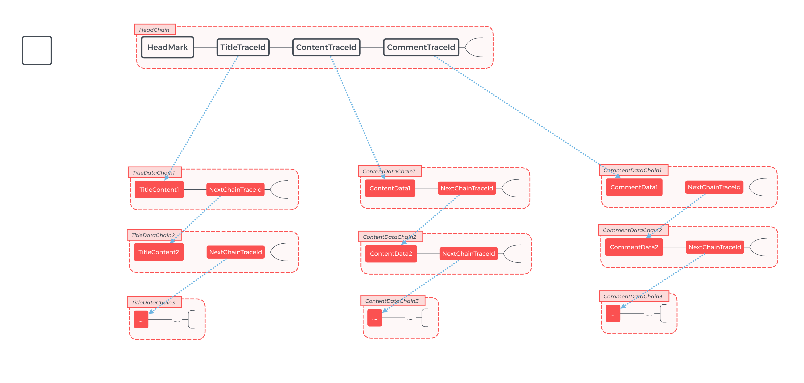

# Mixin Decentralization BBS

![](https://img.shields.io/badge/Mixin-Network-2995f2.svg?style=for-the-badge&colorA=1cc2fd&longCache=true&logo=data:image/svg+xml;base64,PHN2ZyB2ZXJzaW9uPSIxLjEiIGlkPSJMYXllcl8xIiB4bWxucz0iaHR0cDovL3d3dy53My5vcmcvMjAwMC9zdmciIHhtbG5zOnhsaW5rPSJodHRwOi8vd3d3LnczLm9yZy8xOTk5L3hsaW5rIiB4PSIwcHgiIHk9IjBweCIgdmlld0JveD0iMCAwIDI0NSAyNDAiIHN0eWxlPSJlbmFibGUtYmFja2dyb3VuZDpuZXcgMCAwIDI0NSAyNDA7IiB4bWw6c3BhY2U9InByZXNlcnZlIj4KPHN0eWxlIHR5cGU9InRleHQvY3NzIj4KCS5zdDB7ZmlsbDojRkZGRkZGO30KPC9zdHlsZT4KPGc+Cgk8Zz4KCQk8cGF0aCBjbGFzcz0ic3QwIiBkPSJNMjI3LjEsMzMuM2wtMzYuMywxNi4xYy0yLjIsMS4yLTMuNSwzLjUtMy41LDUuOXYxMjkuOGMwLDIuNSwxLjQsNC44LDMuNiw1LjlsMzYuMywxNS43YzIuMywxLjIsNS0wLjQsNS0zJiMxMDsmIzk7JiM5OyYjOTtWMzYuM0MyMzIuMSwzMy43LDIyOS4zLDMyLjEsMjI3LjEsMzMuM3ogTTUzLjMsNDkuMmwtMzUuMi0xNmMtMi4zLTEuMi01LDAuNC01LDN2MTY3LjRjMCwyLjcsMyw0LjMsNS4yLDIuOWwzNS40LTE4LjcmIzEwOyYjOTsmIzk7JiM5O2MyLTEuMiwzLjItMy40LDMuMi01Ljd2LTEyN0M1Ni44LDUyLjcsNTUuNSw1MC40LDUzLjMsNDkuMnogTTE2My43LDkzLjVsLTM3LjktMjEuN2MtMi4xLTEuMi00LjctMS4yLTYuNywwTDgwLjUsOTMuMyYjMTA7JiM5OyYjOTsmIzk7Yy0yLjEsMS4yLTMuNCwzLjUtMy40LDUuOXY0NGMwLDIuNCwxLjMsNC43LDMuNCw1LjlsMzguNiwyMi4yYzIuMSwxLjIsNC43LDEuMiw2LjcsMGwzNy45LTIyYzIuMS0xLjIsMy40LTMuNSwzLjQtNS45di00NCYjMTA7JiM5OyYjOTsmIzk7QzE2Ny4xLDk2LjksMTY1LjgsOTQuNywxNjMuNyw5My41eiIvPgoJPC9nPgo8L2c+Cjwvc3ZnPg==)

基于 Mixin-Network 的去中心化论坛系统

## 概述

### 存储结构

一篇包含 `标题`，`主要内容`以及`评论`的文章的存储结构，如下图所示。

将字符串压缩后拆散成每块字符长度不超过定长的段落，并在尾部添加下一个 chain 的 uuid，然后通过在转账时顺序写入 Memo，记录到 Mixin Network 上。

### 去中心化

* Mixin-Network 主网未上线的阶段，在不公开 PrivateKey 的情况下，依旧是中心化运作。
* Mixin-Network 主网上线后，会对外提供 `TraceKey`，允许外部访问和拉取全部的帖子列表、内容、评论（但存在效率的问题）

## 完成情况
* [x] 提供 Api 进行帖子的增删改查，`是否允许删除仍在考虑`
* [x] 提供 Api 进行帖子的评论，`评论的删除和修改暂不支持`
* [ ] 提供 试用的站点 dbbs.mixin.space (加急建设中)

## TODO
* [ ] 点赞以及其他功能的构想
* [ ] 未来会考虑向 基于 Mixin-Network-IPFS 的类似方案上面靠拢 
 

## LICENSE
MIT